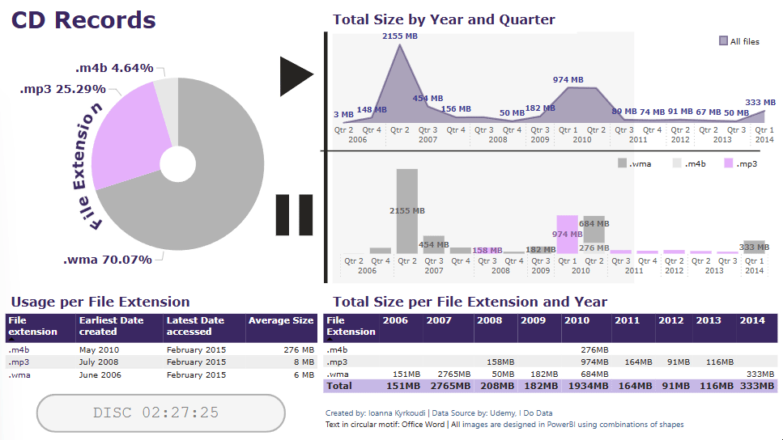

# 📊 CD Records Dashboard

## 📝 Project Overview
This Power BI dashboard analyzes old CD, focusing on file extensions, sizes and usage statistics.

## 📌 Features
✔ Visuals as filters 
✔ Dynamic visualizations (table vs matrix, area chart, stacked column chart, donut chart)
✔ Custom legends
✔ Use of multiple layers

## 📂 Files
- **CD_Records.pbix** → Full Power BI file
- **CD_Records_Preview.gif** → Interactive demo

## 📥 Download & Use
1️⃣ Download the `.pbix` file  
2️⃣ Open it in **Power BI Desktop**  
3️⃣ Browse around and enjoy!
