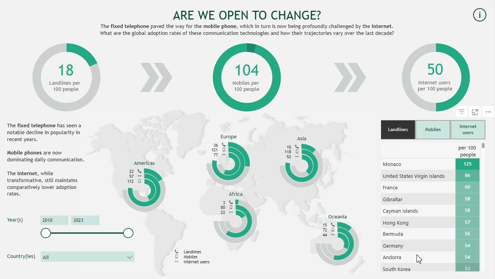

# 📊 CD Records Dashboard

## 📝 Project Overview
This Power BI dashboard, created for participating in the PBI10 Dataviz Contest, analyses the global adoption pace of communication technologies (fixed telephone vs mobile phone vs internet) since 2010. Is your region open or resistant to changes and how does it compare to other regions?

[Explore the live dashboard here](https://community.fabric.microsoft.com/t5/Contests-Gallery/PBI10-Change-in-Technology-Adoption/m-p/4765918)
[Learn about the #PBI10 Dataviz Contest here](https://community.fabric.microsoft.com/t5/Power-BI-Community-Blog/PBI10-Dataviz-Contest/ba-p/4738013)

## 📌 Features
✔ Custom tooltips
✔ Visuals as filters 
✔ Dynamic visualizations (cards, overflowing donut charts, stacked donut charts, tables and slicers)
✔ Custom legends
✔ Use of multiple layers
✔ Conditional formatting
✔ DAX formulas for data transformation
✔ Use of image URLs to load icons

## 📂 Files
- **PBI10_Change_in_Technology_Adoption.pbix** → Full Power BI file
- **PBI10_Change_in_Technology_Adoption.gif** → Interactive demo

## 📥 Download & Use
1️⃣ Download the `.pbix` file  
2️⃣ Open it in **Power BI Desktop**  
3️⃣ Browse around and enjoy!

