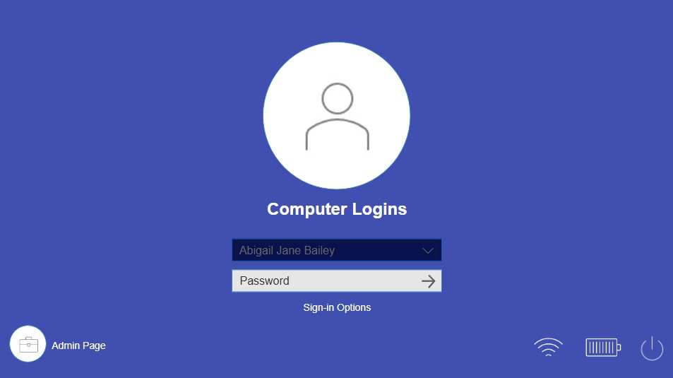

# 📊 Computer Logins Dashboard

## 📝 Project Overview
This Power BI dashboard analyzes computer login activity by user and summarizes the available data in an admin view.

## 📌 Features
✔ Card, Calendar heatmap (using Matrix), Matrix with Sparklines and Data Bars
✔ Navigation buttons
✔ Drillthrough feature
✔ DAX functions
✔ Date table (incl. date hierarchy)

## 📂 Files
- **Computer_Logins.pbix** → Full Power BI file
- **Computer_Logins.gif** → Interactive demo --Coming soon

## 📥 Download & Use
1️⃣ Download the `.pbix` file  
2️⃣ Open it in **Power BI Desktop**  
3️⃣ Browse around and enjoy!
 
