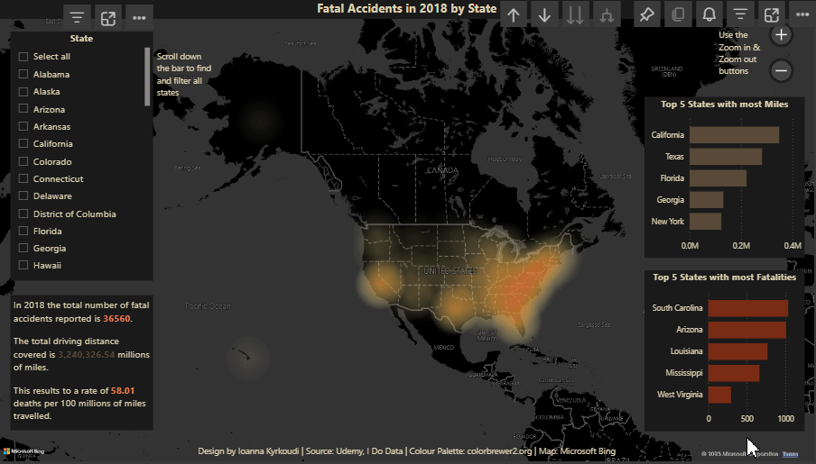

# 📊 Driving Safety in US Dashboard

## 📝 Project Overview
This Power BI dashboard is designed to showcase the number of fatal driving accidents in the US for 2018. This is compared between the 50 states along with the miles driven in the same year.

## 📌 Features
✔ Heatmap, Smart narrative visual, Barchart
✔ Location hierarchy (country, state)
✔ Filters with selected interaction, TopN visual filtering
✔ DAX function (RANK)
✔ Colorblind friendly

## 📂 Files
- **Driving_Safety_US.pbix** → Full Power BI file
- **Driving_Safety_US.gif** → Interactive demo

## 📥 Download & Use
1️⃣ Download the `.pbix` file  
2️⃣ Open it in **Power BI Desktop**  
3️⃣ Browse around and enjoy!
 
