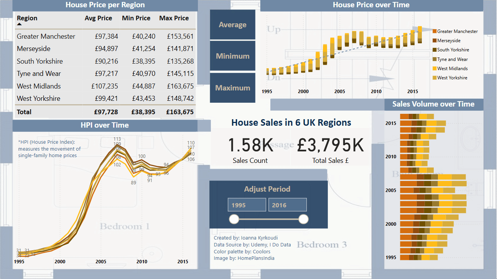

# 📊 Real Estate Trends in UK

## 📝 Project Overview
This Power BI dashboard analyzes the real estate prices and home sales in across 6 UK regions, including the country's home price index metric (annual difference in house purchase cost for a family).

## 📌 Features
✔ KPIs: Sales Count and Total Sales £
✔ Interactive slicer for Start Year and End Year
✔ Dynamic visualizations (table, scatter chart, line chart and stacked bar chart)
✔ Alternative chart view buttons (for Average, Minimum and Maximum prices - when none is selected all prices appear)

## 📂 Files
- **Real_Estate_Trends_UK.pbix** → Full Power BI file  
- **Real_Estate_Trends_UK_Preview.gif** → Interactive demo

## 📥 Download & Use
1️⃣ Download the `.pbix` file  
2️⃣ Open it in **Power BI Desktop**  
3️⃣ Browse around and enjoy!
